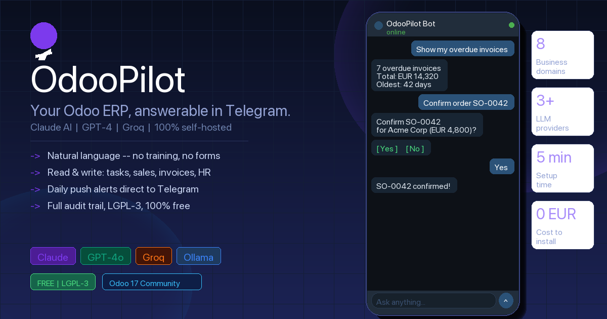

# OdooPilot



**Your team uses Odoo — without logging in to Odoo.**

OdooPilot gives every employee an AI assistant on Telegram or WhatsApp that connects to the
same Odoo instance, scoped to the same permissions they already have. They apply for leave,
approve requests, check tasks, update the CRM pipeline, and validate stock moves — by chatting
with a bot in their own language. No Odoo login, no app to install, no training.

> **For your internal team.** Not for your customers. Each linked chat user is an Odoo user,
> sees only the data they're authorised to see, and every write is recorded in the audit trail.

```
Mira (WhatsApp):    "I need 3 days off next month — Mar 14–16."
OdooPilot:          "Filed leave request for 3 days (Mar 14–16). Carlos has been notified."

Carlos (Telegram):  [inline button: ✅ Approve   ❌ Refuse ]
Carlos:             taps Approve.
OdooPilot:          "✅ Leave approved. Mira has been notified."
```

The Odoo adoption problem solved: data is no longer stale because the people who generate it
(field sales, warehouse staff, anyone who occasionally needs HR or Project) finally have a way
to reach Odoo that fits their day. Same data, same permissions, same audit trail — just lower
friction.

No external service to host. No per-seat SaaS fees. Everything runs inside your Odoo instance.  
Powered by **Claude AI**, **ChatGPT / GPT-4**, **Groq** (free tier), or **Ollama** (100% local).  
Works on **Telegram** and **WhatsApp**. Supports **15 languages**. LGPL-3 open-source.

---

## What it does

- **Conversational queries on live Odoo data** — Tasks, CRM, Sales, Invoices, Inventory, Purchase, HR, Leaves
- **Write actions with a confirmation gate** — Yes/No button required before any record changes
- **Voice messages** — speak instead of typing; the bot transcribes (Whisper) and runs the same agent loop
- **Two channels, full parity** — Telegram bot and WhatsApp Cloud API
- **Choice of LLM** — Anthropic Claude, OpenAI GPT-4o, Groq (free tier), or Ollama (100% local)
- **15 UI languages** — per-user `/language` command
- **Proactive notifications** — daily task digest and overdue-invoice alerts
- **Self-hosted** — pure Odoo addon, runs entirely inside your instance, no separate service
- **Auditable** — immutable log of every AI action (timestamp, user, tool, args, result)
- **Open source** — LGPL-3, free to install, fork, and extend

---

## Architecture

Everything runs inside the Odoo addon — no separate Python service, no Docker container, no cloud deployment.

```
 Telegram                       WhatsApp Cloud API
     │                                  │
     │  HTTPS POST                      │  HTTPS POST
     │  X-Telegram-Bot-                 │  X-Hub-Signature-256
     │  Api-Secret-Token                │  (HMAC-SHA256 of body)
     ▼                                  ▼
┌──────────────────────────────────────────────────────────────────┐
│  OdooPilot Odoo Addon                                            │
│                                                                  │
│  ┌────────────────────────────────────────────────────────┐     │
│  │  HTTP Controllers  (controllers/main.py)               │     │
│  │  • Verify webhook signature in constant time           │     │
│  │  • Per-(channel, chat_id) sliding-window rate limit    │     │
│  │  • Idempotency dedup on update_id / messages[].id      │     │
│  │  • Voice msg? download + transcribe via STT first      │     │
│  │  • Hand off to bounded worker pool                     │     │
│  └────┬───────────────────────────┬───────────────────────┘     │
│       │ text                      │ voice                       │
│       │                           ▼                             │
│       │            ┌──────────────────────────────┐            │
│       │            │  STT Client (services/stt)   │            │
│       │            │  Groq whisper-large-v3 / OAI │            │
│       │            │  whisper-1 · key scrubbed    │            │
│       │            └──────────────┬───────────────┘            │
│       │                           │ transcript                 │
│  ┌────▼───────────────────────────▼───────────────────────┐     │
│  │  Agent  (services/agent.py)                            │     │
│  │  • Load session · build messages · run LLM tool loop   │     │
│  │  • Read tools execute immediately                      │     │
│  │  • Write tools → preflight → resolve target → stage    │     │
│  │    pending_args + per-write nonce → ask Yes/No         │     │
│  │  • On confirmed Yes → execute under linked-user env    │     │
│  └────┬─────────────────────────────────┬─────────────────┘     │
│       │                                 │                        │
│  ┌────▼──────────┐         ┌────────────▼────────────────┐      │
│  │  LLM Client   │         │  ORM Tools (services/tools) │      │
│  │  Anthropic    │         │  project / sales / crm      │      │
│  │  OpenAI       │         │  invoices / inventory       │      │
│  │  Groq         │         │  purchase / hr / leaves     │      │
│  │  Ollama       │         │  + 5 write tools w/ confirm │      │
│  └───────────────┘         └─────────────────────────────┘      │
│                                                                  │
│  Models                                                          │
│  ────────                                                        │
│  odoopilot.session         conversation history + pending nonce  │
│  odoopilot.identity        chat_id → Odoo user mapping           │
│  odoopilot.audit           immutable log of every tool call      │
│  odoopilot.link.token      SHA-256 hashed magic-link tokens      │
│  odoopilot.delivery.seen   webhook idempotency table             │
└──────────────────────────────────────────────────────────────────┘
```

---

## Quickstart

### Prerequisites

- Odoo **17.0 Community** (self-hosted or Odoo.sh)
- An LLM API key — [Anthropic](https://console.anthropic.com), [OpenAI](https://platform.openai.com), [Groq](https://console.groq.com) (free tier, no card), or a local [Ollama](https://ollama.com) endpoint
- One of:
  - A **Telegram bot token** from [@BotFather](https://t.me/BotFather), and/or
  - A **WhatsApp Business** account with the [Meta Cloud API](https://developers.facebook.com/docs/whatsapp/cloud-api) enabled (phone number ID, access token, app secret)
- Odoo must be reachable from the internet (for webhook delivery)

### 1. Install the addon

Copy the `odoopilot/` directory into your Odoo addons path, then:

```bash
# Restart Odoo and update the module list
./odoo-bin -c odoo.conf -u odoopilot
```

Or install from the Odoo App Store:
- [Odoo 17](https://apps.odoo.com/apps/modules/17.0/odoopilot)
- [Odoo 18](https://apps.odoo.com/apps/modules/18.0/odoopilot)

### 2. Configure in Odoo Settings

Go to **Settings → OdooPilot** and fill in the channels you want to enable.

#### Telegram

| Field | Value |
|-------|-------|
| Telegram Bot Token | Paste the token from @BotFather |

Then click **Register Webhook**. The action calls Telegram's `setWebhook` API and **auto-generates a 32-byte secret**, which Telegram echoes back on every delivery as `X-Telegram-Bot-Api-Secret-Token`. The endpoint rejects any request whose header doesn't match.

#### WhatsApp

| Field | Value |
|-------|-------|
| WhatsApp Phone Number ID | From Meta App Dashboard → WhatsApp → API setup |
| WhatsApp Access Token | Permanent token from Meta App Dashboard |
| WhatsApp Verify Token | Any random string — paste the same value into Meta's webhook config |
| WhatsApp App Secret | App Secret from Meta App Dashboard → Settings → Basic |

Then in Meta's webhook config, set the callback URL to `https://YOUR_ODOO/odoopilot/webhook/whatsapp` and the verify token to whatever you pasted above.

> The App Secret is **mandatory**. Without it the WhatsApp webhook refuses all traffic. Meta signs every POST with `X-Hub-Signature-256` (HMAC-SHA256 of the raw body keyed with the App Secret); OdooPilot verifies this in constant time before any business logic runs.

#### LLM provider

| Field | Value |
|-------|-------|
| LLM Provider | `anthropic`, `openai`, `groq`, or `ollama` |
| LLM API Key | Your provider key (not used for `ollama`) |
| LLM Model (optional) | Override the default — see table below |

Default models if you leave the override blank:

| Provider | Default model | Notes |
|----------|---------------|-------|
| `anthropic` | `claude-3-5-haiku-20241022` | Best reasoning per dollar |
| `openai` | `gpt-4o-mini` | Widest ecosystem |
| `groq` | `llama-3.3-70b-versatile` | Free tier, very fast |
| `ollama` | (set in override) | 100% local, e.g. `llama3.2` |

#### Voice messages (optional)

Off by default. When enabled, employees can hold-to-record on Telegram or WhatsApp instead of typing — OdooPilot transcribes via Whisper and runs the transcript through the same agent loop. The killer use case is warehouse pickers, drivers, anyone whose hands aren't free.

| Field | Value |
|-------|-------|
| Voice messages | Enable |
| STT Provider | `groq` (free tier, recommended) or `openai` |
| STT API Key | Your provider key (can be the same key as the LLM provider when both are Groq or both are OpenAI) |
| STT Model | Leave blank for default (`whisper-large-v3` for Groq, `whisper-1` for OpenAI) |
| Max voice duration (seconds) | Default `60`. Voice notes longer than this are rejected before download — bandwidth + STT cost protection |

A Groq-on-everything operator pays **$0** for voice support indefinitely. On OpenAI: ~$0.006 per audio-minute. Hard caps: 25 MB per file, default 60 s per message — both configurable. The scope guard runs on the transcript, so spoken jailbreaks get the same refusal as typed ones.

#### Optional throttling knobs

These are read once at first use from `ir.config_parameter`. Defaults are fine for most installs; raise them if your team is large, lower them if you suspect abuse.

| Parameter | Default | What it controls |
|-----------|---------|------------------|
| `odoopilot.rate_limit_per_hour` | `30` | Max messages per (channel, chat_id) per window (voice + text combined) |
| `odoopilot.rate_limit_window_seconds` | `3600` | Sliding-window length |
| `odoopilot.worker_pool_size` | `8` | Bounded thread pool for webhook dispatch |
| `odoopilot.voice_max_duration_seconds` | `60` | Max length of a single voice note (cost / DoS guard) |

### 3. Link employee accounts

Each employee sends `/link` to the bot. The bot replies with a one-time URL.
The employee opens the URL while logged into Odoo, sees a confirmation page,
clicks **Confirm and link**, and they're done.

The flow uses a **two-step CSRF-protected handshake**: GET previews, POST consumes. A logged-in admin who renders an `` from a malicious record won't get silently linked — the consume only happens on a POST with Odoo's session-bound CSRF token.

### 4. Start chatting

Each linked user can send:

- Any natural-language question — *"What invoices are overdue?"*, *"Show my open tasks"*, *"Approve John's leave"*
- `/start` — short hello
- `/link` — re-issue a linking URL (existing identity is replaced)
- `/language <code>` — set their preferred reply language (15 supported); `/language auto` to revert to auto-detect

Read tools execute immediately. Write tools show an inline **Yes / No** button — the prompt names the resolved record (not the LLM's argument string), and the click carries a per-write nonce so it can't be swapped out from under you.

---

## Supported domains

| Domain | Read | Write (with confirmation) |
|--------|------|--------------------------|
| Project & Tasks | ✅ list, filter, deadlines | ✅ mark task done |
| Sales & CRM | ✅ pipeline, orders, revenue | ✅ confirm sale order · update CRM stage · create lead |
| Invoices & Accounting | ✅ overdue, balances, bills | — |
| Inventory | ✅ stock levels, locations | — |
| HR & Leaves | ✅ leave balances, pending requests, employees | ✅ approve leave |
| Purchase | ✅ purchase orders, RFQs | — |

Write tools always show an inline Yes/No confirmation before touching data.

---

## LLM providers

OdooPilot calls each provider's HTTP API directly via `requests` — no extra Python dependencies beyond what Odoo already ships, and you can swap providers in **Settings → OdooPilot** without restarting. See the [Quickstart table](#llm-provider) above for the four supported providers and their default models.

To run **100% local** with no third-party API calls, pick `ollama` and point the provider at your local Ollama endpoint via `odoopilot.ollama_base_url` (default `http://localhost:11434`). Your business data and prompts never leave your server.

---

## Sizing & capacity

The most common operator question: *will this handle my team?* Short answer for almost any deployment up to ~5,000 employees: **yes, and the binding constraint is your LLM provider's rate limit, not OdooPilot or Odoo**.

### What to set, by team size

Pick the row that matches your headcount. The defaults work up to ~200 employees with no tuning at all.

| Team size | Daily volume | Pool size | Odoo workers | LLM provider tier | Daily LLM cost (~) |
|---|---|---|---|---|---|
| **20**, casual | ~100 msg/day | default (`8`) | `--workers=2` | Groq free tier | $0 |
| **100**, daily use | ~1,000 msg/day | default (`8`) | `--workers=2` | OpenAI Tier 1 ($5 spent) | ~$1 |
| **300**, all-day | ~3,000 msg/day | `16` | `--workers=4` | Claude Tier 2 or OpenAI Tier 1 | ~$5 |
| **1,000** | ~15,000 msg/day | `32` | `--workers=4` | Claude Tier 3 or OpenAI Tier 2 | ~$15–30 |
| **5,000+** | ~75,000+ msg/day | `64` | `--workers=8`+ | Anthropic Tier 4 / OpenAI scaled | ~$100+ |

**Pool size** is set in *Settings → Technical → System Parameters → `odoopilot.worker_pool_size`*. **Odoo workers** is the `--workers=N` flag on `odoo-bin`.

### Why the LLM provider, not OdooPilot, is the bottleneck

Each layer's ceiling at default config:

| Layer | Ceiling |
|---|---|
| OdooPilot bounded worker pool | 8 concurrent in-flight messages → ~50 msg/min sustained |
| OdooPilot per-chat rate limit | 30 messages/hour per chat (`odoopilot.rate_limit_per_hour`) |
| Odoo HTTP frontend (`--workers=2`) | a few hundred req/sec — the webhook handler is sub-100ms |
| PostgreSQL (audit + session) | trivial below ~100 msg/sec |
| **LLM provider rate limit** | **typically the binding constraint** |

Provider rate limits at the tiers most teams actually use:

| Provider | Tier | Rate limit | Comfortable team size |
|---|---|---|---|
| Groq (free) | none | ~50 RPM | up to ~50 employees |
| OpenAI | Tier 1 ($5 spent) | 500 RPM | up to ~1,000 employees |
| Anthropic | Tier 2 (~$40/mo) | ~1,000 RPM | up to ~2,000 employees |
| Anthropic | Tier 4 | 4,000+ RPM | 5,000+ employees |
| Ollama | local | bound by your GPU | bound by your GPU |

### Watch for

- **First 9 AM / first 5 PM**: peak hours typically run 3–4× the daily average. Size for the peak, not the average.
- **One employee monopolising the bot**: capped at 30 messages/hour by the per-chat rate limit (voice + text combined). They can request a higher limit by editing `odoopilot.rate_limit_per_hour` for the whole install (no per-user override yet).
- **Multi-Odoo-worker fairness**: the throttle is in-process per Odoo HTTP worker. If you run `--workers=4`, each worker has its own counter — so a chatty user effectively gets `30 × 4 = 120` msg/hour rather than 30. Acceptable for almost all teams; if you need a hard global cap, that requires a Redis-backed limiter (not built today, see roadmap).
- **LLM cost overruns**: the audit log is your friend. *Settings → OdooPilot → Audit Log* with the *Group by user* filter shows you who's burning the budget.

### Voice messages — capacity notes

When voice is enabled, each voice note costs **one STT call + one LLM call** instead of just one LLM call. The total throughput stays bounded by the same rate-limit and worker-pool ceilings; only the cost per message changes.

| Provider | STT cost | Throughput cap |
|---|---|---|
| Groq (`whisper-large-v3`, free tier) | $0 | shared with Groq LLM rate limit |
| OpenAI (`whisper-1`) | ~$0.006 / audio-minute | 50 RPM at Tier 1, way more at higher tiers |

Two safeguards bound the worst-case cost:

- **`odoopilot.voice_max_duration_seconds`** (default 60) — voice notes longer than this are rejected before download. Caps both bandwidth and STT spend per message.
- **25 MB hard cap** in `services/stt.py` — matches Whisper's own limit, prevents oversized-file abuse regardless of duration.

Practical guidance: a 300-employee deployment with 10% voice adoption (3 voice notes / day per voice user = ~90 voice messages / day) costs **~$1/day extra** on OpenAI Whisper, **$0** on Groq. The per-chat rate limit makes runaway costs impossible without an authenticated linked user.

### Self-test before the first real user logs in

1. Install the addon. Configure Telegram bot token + LLM API key in Settings.
2. Click *Register Webhook*. Watch the Odoo log for `OdooPilot: rejecting Telegram webhook` warnings (a sign of a misconfigured secret).
3. Send `/start` to your bot. You should get the welcome reply within 1–2 seconds.
4. Send `/link`, click the URL, confirm — you should land on the success page.
5. Send a real query: *"Show me my open tasks."* If it works, you're done. If not: check *Settings → OdooPilot → Audit Log* for the failure reason.

---

## Security

OdooPilot has been through a public audit (April 2026, [u/jeconti on r/Odoo](https://github.com/arunrajiah/odoopilot/blob/main/CHANGELOG.md#17070--2026-04-26--security-release)) and three follow-up internal reviews. The current model:

### Webhook authentication
- **Telegram** verifies the `X-Telegram-Bot-Api-Secret-Token` header on every POST. The secret is **mandatory** and auto-generated by the *Register webhook* action; missing or mismatched secret returns 403.
- **WhatsApp** verifies Meta's `X-Hub-Signature-256` HMAC-SHA256 in constant time. The Meta App Secret is **mandatory**; without it the endpoint returns 403.
- Both compares use `hmac.compare_digest`.

### Per-write confirmation that survives prompt injection
- Every write tool runs `preflight_write` to **resolve the target record before staging** — the staged args carry a real `res_id`, not the LLM's argument string. Wildcard-only or overly-short names are rejected outright.
- The confirmation prompt names the **resolved record's `display_name`**, so a user clicking *Yes* sees what they're actually about to mutate (not what the LLM claimed it was).
- Every staged write generates a fresh `secrets.token_urlsafe(12)` nonce embedded in the Yes/No button payload. A prompt injection that tries to swap the staged tool between staging and the click rotates the nonce and the click is rejected.

### Magic-link account binding
- Tokens are stored as SHA-256 digests (the raw token never persists), single-use, and expire after one hour.
- The link flow is **two-step CSRF-protected**: GET shows a preview page; POST with Odoo's session-bound CSRF token does the actual link. Cross-site `` attacks cannot silently link an admin's account.
- Identity hijack defence: a logged-in user with a valid token cannot overwrite an existing `(channel, chat_id)` mapping owned by a different user — the attempt is refused at both preview and commit.

### User scoping
- Each chat is resolved to an `odoopilot.identity` row. The agent then runs under that Odoo user (`sudo_env(user=identity.user_id.id)`) — every read and write is filtered by the user's existing record-rule access. The bot **cannot do more than the user could do interactively**.
- Webhook dispatch helpers receive `sudo_env` (named explicitly) only for the unavoidable bootstrap lookups (config, identity, session, link token). All business-data access uses the user-scoped env.

### Cost & resource bounds
- Per-(channel, chat_id) sliding-window rate limit prevents an authenticated user (or a flood of forged messages) from driving unbounded paid-LLM spend.
- Bounded thread pool replaces the previous unbounded daemon-thread spawn — saturation drops gracefully with HTTP 200 so the platform doesn't retry-storm.

### Idempotency
- Telegram retries on 5xx and timeouts; WhatsApp likewise. The `odoopilot.delivery.seen` table dedups on Telegram `update_id` and WhatsApp `messages[].id` with a SQL UNIQUE constraint. A redelivered confirmation click cannot re-execute the staged write.

### Operational hygiene
- Audit log writes an immutable `odoopilot.audit` row for every tool call (timestamp, user, tool, args, result, success).
- Telegram bot tokens are scrubbed from any logged exception string.
- Static security scanning (`bandit` + `semgrep`) runs in CI on every push.

### Reporting a vulnerability

Please don't disclose publicly. Use [GitHub Security Advisories](https://github.com/arunrajiah/odoopilot/security/advisories/new) — see [SECURITY.md](SECURITY.md) for the full disclosure policy, supported versions, and threat model.

---

## Status & roadmap

Current releases:
- `17.0` branch — **17.0.16.0.0** (Beta, on the [Odoo 17 App Store](https://apps.odoo.com/apps/modules/17.0/odoopilot))
- `18.0` branch — **18.0.6.0.0** (Beta, on the [Odoo 18 App Store](https://apps.odoo.com/apps/modules/18.0/odoopilot))

CHANGELOG: [full history](CHANGELOG.md).

### Recently shipped (last two weeks)

| Version | Date | Theme |
|---------|------|-------|
| **17.0.16.0.0** / **18.0.6.0.0** | 2026-05-03 | Voice messages → Whisper STT → existing text agent loop. Opt-in; Groq free tier or OpenAI; 60-second cap by default |
| **17.0.15.0.0** / **18.0.4.0.0** | 2026-05-03 | Internal security audit fixes — scope-guard Unicode + foreign-language bypasses, employee_id rebinding, find_partner cap, rate-limiter GC |
| **17.0.14.0.0** / **18.0.3.0.0** | 2026-05-03 | Employee-self-service tool sprint — `find_partner` + `clock_in/out` + `submit_expense` + `submit_timesheet` + `create_calendar_event` (tool count 13 → 19) |
| **17.0.13.0.0** / **18.0.2.0.0** | 2026-05-03 | Scope guard — refuse off-topic / extraction / jailbreak attempts before paying for an LLM call; hardened SYSTEM_PROMPT |
| **17.0.12.0.0** | 2026-05-02 | Operator admin views — Linked Users dashboard with activity columns, Audit Log with failure-decoration + filters + group-bys |
| **17.0.11.0.0** | 2026-05-02 | Polish pass — new banner, CI security scanning (bandit/semgrep), listing renderable check |
| **18.0.1.0.0** | 2026-05-02 | First Odoo 18 release (Alpha) — static port |
| **17.0.10.0.0** | 2026-04-28 | Repositioning + community panel + listing fix |
| **17.0.9.0.0** | 2026-04-27 | Defence-in-depth — token scrub, sudo_env rename, hygiene |
| **17.0.8.0.0** | 2026-04-27 | 5 fixes from internal post-release audit (CSRF, hijack, wildcard, rate limit, idempotency) |
| **17.0.7.0.0** | 2026-04-26 | Public audit fixes (HMAC, mandatory secret, per-write nonce, hashed tokens) |

### Coming next

**1. OCA submission.** Both 17 and 18 are now Beta on the App Store, the security model has been audited four times, the test suite is comprehensive, and the codebase follows Odoo conventions. Time to submit upstream.

**2. Operator-side:**

- ✅ **Validate Odoo 18 install** and submit the listing to `apps.odoo.com` — done, [live on the App Store](https://apps.odoo.com/apps/modules/18.0/odoopilot)
- 📋 **OCA submission** — next, now that both 17 and 18 are on the App Store
- 📋 **Odoo 16 backport** — low priority, only if there is operator demand
- 📋 **Redis-backed rate limiter** — only if a multi-Odoo-worker deployment needs hard global rate caps

---

## Contributing

Pull requests welcome. The fastest path to a merged PR:

1. Pick an unimplemented tool or domain from the table above
2. Add it to `odoopilot/services/tools.py` following the existing pattern
3. Register the tool schema in `odoopilot/services/agent.py`
4. Open a PR — CI must be green (ruff format + lint + XML check)

See [CONTRIBUTING.md](CONTRIBUTING.md) for full details.

---

## Sponsor & feedback

OdooPilot is free, open-source, and solo-maintained. After install, **Settings → OdooPilot** ends with quick links for all of these — or use the URLs directly:

- **♥ Sponsor on GitHub** → https://github.com/sponsors/arunrajiah
- **💬 Feedback & ideas** → https://github.com/arunrajiah/odoopilot/discussions/new?category=ideas
- **🛠 Report a bug** → https://github.com/arunrajiah/odoopilot/issues/new/choose
- **🔒 Report a security issue (private)** → https://github.com/arunrajiah/odoopilot/security/advisories/new

---

## License

[LGPL-3.0-or-later](LICENSE) — same as Odoo Community and OCA modules.
